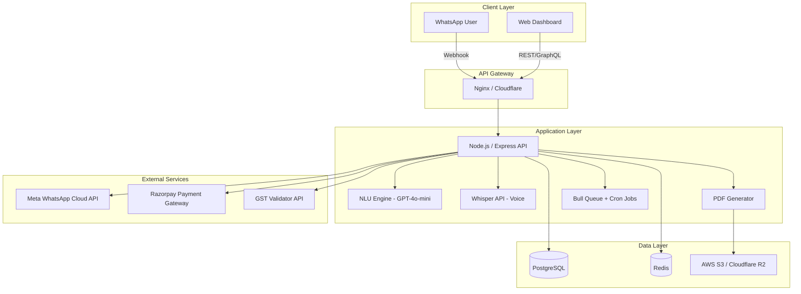

# 🧾 BillKaro — WhatsApp-First Smart Invoicing & Collection Bot

## Complete Product Blueprint for Indian SME Market

> **Tagline**: *"Bol ke bill banao, WhatsApp pe paisa pao."*
> (Say it to bill it, get paid on WhatsApp.)

---

## Table of Contents

1. [WhatsApp Invoice Generation Workflow](#1-whatsapp-invoice-generation-workflow)
2. [Automated "Chaser" Logic](#2-automated-chaser-logic)
3. [Owner's Web Dashboard](#3-owners-web-dashboard)
4. [Tech Stack & Integrations](#4-tech-stack--integrations)
5. [Go-To-Market & Cross-Selling](#5-go-to-market--cross-selling)
6. [30-Day MVP Roadmap](#6-30-day-mvp-roadmap)

---

## 1. WhatsApp Invoice Generation Workflow

### Design Philosophy

The user sends **one natural-language message** (text or voice note) and receives a GST-compliant PDF invoice back in under 10 seconds. Zero menus, zero forms, zero app downloads.

### The Core Flow (Happy Path)

```
┌─────────────────────────────────────────────────────────┐
│  CONTRACTOR (WhatsApp)          BILLKARO BOT            │
│                                                         │
│  "Bill 5000 to Rahul for                                │
│   AC repair + gas refill"  ──►  NLU Parse               │
│                                    │                    │
│                                 Extract:                │
│                                 • Amount: ₹5,000        │
│                                 • Client: Rahul         │
│                                 • Items: AC repair,     │
│                                   gas refill            │
│                                    │                    │
│                              ◄──  Confirmation Card     │
│                                                         │
│  "✅ Confirm" (button tap)  ──►  Generate Invoice       │
│                                    │                    │
│                                 • PDF generated         │
│                                 • UPI link embedded     │
│                                 • Invoice # assigned    │
│                                    │                    │
│                              ◄──  PDF + Pay Link        │
│                                                         │
│  (Auto-forward to Rahul   ──►  Delivery to Client      │
│   or share manually)              with payment link     │
└─────────────────────────────────────────────────────────┘
```

### Step-by-Step Chat Transcript

#### Step 1: User Input (Text or Voice)

**Text Example:**
```
User: Bill 8500 to Priya Constructions for waterproofing work at Sector 45
```

**Voice Note Example:**
```
User: 🎤 "Priya Constructions ko bill bhejo, aath hazaar paanch sau,
       waterproofing ka kaam tha Sector 45 mein"
```

**NLU Engine Extracts:**
| Field | Extracted Value |
|---|---|
| Client Name | Priya Constructions |
| Amount | ₹8,500 |
| Line Item(s) | Waterproofing work |
| Location/Notes | Sector 45 |
| GST | Auto-applied from owner's profile (18% default) |
| Due Date | Auto-set: 7 days from today (configurable) |

#### Step 2: Bot Sends Confirmation Card

The bot replies with a structured WhatsApp message using **interactive buttons**:

```
📄 *Invoice Preview*
━━━━━━━━━━━━━━━━━━
🏢 *To:* Priya Constructions
💰 *Amount:* ₹8,500
📝 *For:* Waterproofing work
📍 *Note:* Sector 45
🏷️ *GST (18%):* ₹1,530
💵 *Total:* ₹10,030
📅 *Due:* 02-Apr-2026

[✅ Send Invoice]  [✏️ Edit]  [❌ Cancel]
```

#### Step 3a: User Taps "✅ Send Invoice"

- PDF is generated in < 3 seconds (server-side)
- The bot sends back:

```
✅ *Invoice #BK-2026-0047 Created!*

📎 [Invoice PDF attached]

🔗 *Payment Link (UPI):*
upi://pay?pa=priya@upi&pn=BillKaro&am=10030&tn=INV-BK-2026-0047

━━━━━━━━━━━━━━━━━━
👉 *Forward this to your client?*
[📤 Send to Priya]  [📋 Copy Link]
```

#### Step 3b: User Taps "✏️ Edit"

Bot enters edit mode with specific prompts:

```
Bot: What would you like to change?
     [💰 Amount]  [👤 Client]  [📝 Items]  [📅 Due Date]
```

User selects `💰 Amount`, bot asks:
```
Bot: Current amount is ₹8,500. Send the new amount:
```
User: `9000`
```
Bot: ✅ Updated to ₹9,000. Total with GST: ₹10,620.
     [✅ Send Invoice]  [✏️ Edit More]
```

#### Step 4: Client Delivery

When user taps "📤 Send to Priya":
- Bot checks if Priya's WhatsApp number is saved in the client masterlist
  - **If YES**: Sends invoice directly to Priya via WhatsApp Business API
  - **If NO**: Asks for number → `Bot: "Priya ka WhatsApp number bhejo"`
  - Saves number for future invoices automatically

**Message sent to the client (Priya):**
```
🧾 *Invoice from [Owner's Business Name]*

Hi Priya,

Please find your invoice #BK-2026-0047 for ₹10,030
(Waterproofing work).

📎 [Invoice PDF]
💳 Pay securely: [UPI Payment Link]

Due by: 02-Apr-2026

Thank you for your business! 🙏
— [Owner's Business Name]
```

### Voice Note Processing Pipeline

```
Voice Note (OGG) → WhatsApp Cloud API webhook
    → Whisper API (speech-to-text, Hindi/English/Hinglish)
    → GPT-4o-mini (NLU: extract amount, client, items)
    → Same confirmation flow as text
```

**Supported Languages**: Hindi, English, Hinglish, Marathi, Tamil, Telugu (extensible via Whisper's multilingual model)

### First-Time Onboarding (One-Time Setup via WhatsApp)

When a new user messages the bot for the first time:

```
Bot: 🎉 Welcome to BillKaro!
     Let's set up your business in 60 seconds.

     1️⃣ Your Business Name?
User: Sharma HVAC Solutions

Bot: 2️⃣ Your GSTIN? (Type "skip" if not registered)
User: 27AAPCS1234F1Z5

Bot: 3️⃣ Your UPI ID for receiving payments?
User: sharma.hvac@paytm

Bot: 4️⃣ Default payment terms? (days)
     [7 days]  [15 days]  [30 days]
User: [15 days]

Bot: ✅ All set! You're ready to send invoices.
     Just say: "Bill [amount] to [client] for [work]"
```

**Total onboarding time: ~45 seconds.**

---

## 2. Automated "Chaser" Logic

### Design Philosophy

> The #1 feature that sells this product. Indian SMEs **hate** asking for money.
> BillKaro does it for them — politely, persistently, and professionally.

### Payment Follow-Up Sequence

| Trigger | Timing | Channel | Tone |
|---|---|---|---|
| Invoice Sent | T+0 | WhatsApp to Client | Professional, warm |
| Gentle Reminder | Due Date (T+D) | WhatsApp to Client | Polite nudge |
| Follow-Up 1 | D+3 days | WhatsApp to Client | Friendly concern |
| Follow-Up 2 | D+7 days | WhatsApp to Client + Owner notified | Firm but respectful |
| Escalation Alert | D+15 days | WhatsApp to Owner ONLY | Owner decides next step |

### Exact Message Templates

#### 🟢 Due Date Reminder (Day D)

```
Hi [Client Name] 🙏,

A friendly reminder that invoice #[INV_NO] for ₹[AMOUNT]
([DESCRIPTION]) is due today.

📎 [Invoice PDF]
💳 Quick Pay: [UPI Link]

Thank you!
— [Business Name]
```

#### 🟡 D+3 Days — Gentle Follow-Up

```
Hi [Client Name],

Hope you're doing well! Just following up on invoice
#[INV_NO] for ₹[AMOUNT], which was due on [DUE_DATE].

If already paid, please ignore this message 🙏
💳 Pay now: [UPI Link]

— [Business Name]
```

#### 🟠 D+7 Days — Firm Reminder

```
Hi [Client Name],

This is a reminder that invoice #[INV_NO] for ₹[AMOUNT]
is now 7 days overdue (due: [DUE_DATE]).

To avoid any inconvenience, kindly clear the payment
at your earliest convenience.

💳 Pay now: [UPI Link]
📞 Questions? Call [Owner Phone]

— [Business Name]
```

#### 🔴 D+15 Days — Owner Escalation (NOT sent to client)

```
⚠️ *Overdue Alert*

[Client Name] has NOT paid invoice #[INV_NO]
for ₹[AMOUNT]. It's now 15 days overdue.

[📞 Call Client]  [📤 Send Final Reminder]  [⏸️ Pause Reminders]
```

### Smart Chaser Rules

1. **Auto-Stop on Payment**: When a UPI/Razorpay payment is confirmed, all scheduled reminders are instantly cancelled, and both owner + client get a receipt:
   ```
   ✅ Payment of ₹[AMOUNT] received for Invoice #[INV_NO].
   Thank you, [Client Name]! 🙏
   ```

2. **Manual Payment Marking**: Owner can mark invoice as paid via WhatsApp:
   ```
   Owner: "Rahul ne pay kar diya" or "Mark BK-0047 paid"
   Bot: ✅ Invoice #BK-0047 marked as paid. Reminders stopped.
   ```

3. **Pause/Resume**: Owner can pause reminders for a specific client:
   ```
   Owner: "Priya ke reminders band karo"
   Bot: ⏸️ Paused reminders for Priya Constructions. Say "resume"
        to restart.
   ```

4. **Weekend/Holiday Awareness**: Reminders are never sent on Sundays or national holidays (Diwali, Holi, Independence Day, etc.). They shift to the next business day.

5. **Business Hours Only**: Messages sent between 9 AM – 7 PM IST only.

---

## 3. Owner's Web Dashboard

### Design Philosophy

> The WhatsApp bot handles 90% of daily operations.
> The dashboard is for the **monthly review** — a "bird's eye" view.

**Access**: `app.billkaro.in` — Mobile-first responsive design. Login via WhatsApp OTP (same number used for the bot).

---

### Screen 1: 💰 Financial Overview (Home)

**Purpose**: Answer the question *"Kitna paisa aana baaki hai?"* (How much money is pending?)

```
┌──────────────────────────────────────────────┐
│  BillKaro Dashboard           [Sharma HVAC]  │
│━━━━━━━━━━━━━━━━━━━━━━━━━━━━━━━━━━━━━━━━━━━━│
│                                              │
│  📊 This Month (Mar 2026)                    │
│  ┌──────────┬──────────┬──────────┐          │
│  │ 💰 TOTAL │ ✅ PAID  │ ⏳ DUE   │          │
│  │ ₹3.2L    │ ₹1.8L    │ ₹1.4L    │          │
│  │ 42 bills │ 24 bills │ 18 bills │          │
│  └──────────┴──────────┴──────────┘          │
│                                              │
│  🔴 Overdue: ₹45,000 (3 invoices)           │
│  ┌──────────────────────────────────┐        │
│  │ Priya Constructions  ₹22,000  12d│        │
│  │ Rajesh Electricals   ₹15,000   8d│        │
│  │ MK Solar            ₹ 8,000   3d│        │
│  └──────────────────────────────────┘        │
│                                              │
│  📈 Collection Rate: 78%                     │
│  📉 Avg Days to Pay: 9.2 days               │
│                                              │
│  [📤 Download Report]  [📊 View Trends]      │
└──────────────────────────────────────────────┘
```

**Key Metrics (KPI Cards):**
- Total Invoiced (this month/quarter/custom)
- Total Collected
- Total Pending
- Total Overdue (> due date)
- Collection Rate (%)
- Average Days to Payment

---

### Screen 2: 📋 Invoice List & Search

**Purpose**: Find any past invoice instantly. Filter, search, export.

```
┌──────────────────────────────────────────────┐
│  📋 All Invoices                             │
│  [Search: client, #, amount...]              │
│                                              │
│  Filter: [All ▾] [This Month ▾] [Status ▾]  │
│                                              │
│  ┌─────┬────────────┬────────┬───────┬─────┐ │
│  │ #   │ Client     │ Amount │ Date  │ ⬤   │ │
│  ├─────┼────────────┼────────┼───────┼─────┤ │
│  │ 047 │ Priya Con. │₹10,030 │22-Mar │ 🔴  │ │
│  │ 046 │ Rajesh El. │₹15,000 │20-Mar │ 🟡  │ │
│  │ 045 │ Amit Shah  │₹ 5,900 │18-Mar │ 🟢  │ │
│  │ 044 │ MK Solar   │₹ 8,000 │15-Mar │ 🟡  │ │
│  │ ... │ ...        │ ...    │ ...   │ ... │ │
│  └─────┴────────────┴────────┴───────┴─────┘ │
│                                              │
│  🟢 Paid  🟡 Pending  🔴 Overdue             │
│                                              │
│  [📥 Export CSV]  [📤 Download All PDFs]      │
└──────────────────────────────────────────────┘
```

**Features:**
- Full-text search (client name, invoice number, amount)
- Filter by status: All / Paid / Pending / Overdue
- Filter by date range
- Click any invoice → View PDF, resend to client, mark as paid
- Bulk export to CSV (for the accountant at year-end)

---

### Screen 3: 👥 Client Directory

**Purpose**: A business's most valuable asset — their client list with payment behavior.

```
┌──────────────────────────────────────────────┐
│  👥 Clients (34 total)                       │
│  [Search clients...]                         │
│                                              │
│  ┌──────────────┬────────┬────────┬────────┐ │
│  │ Client       │Invoices│ Pending│ Rating │ │
│  ├──────────────┼────────┼────────┼────────┤ │
│  │ Priya Const. │   12   │₹22,000│ ⭐⭐    │ │
│  │ Amit Shah    │    8   │  ₹0   │ ⭐⭐⭐⭐⭐│ │
│  │ MK Solar     │    6   │₹ 8,000│ ⭐⭐⭐   │ │
│  │ Rajesh El.   │    4   │₹15,000│ ⭐⭐    │ │
│  └──────────────┴────────┴────────┴────────┘ │
│                                              │
│  ⭐ Payment Score: Based on avg. days to pay │
│     ⭐⭐⭐⭐⭐ = Always on time                  │
│     ⭐ = Frequently late (>15 days avg)       │
│                                              │
│  [Click client → full history + contact]     │
└──────────────────────────────────────────────┘
```

**Features per Client:**
- Total invoiced (lifetime)
- Total pending
- Payment history timeline
- Average days to pay → **Client Payment Score** (auto-calculated)
- WhatsApp number, business name, GSTIN (if available)
- Quick action: "Send reminder" / "Create new invoice"

---

## 4. Tech Stack & Integrations

### Architecture Overview



### Detailed Stack Breakdown

| Layer | Technology | Why This Choice |
|---|---|---|
| **Backend API** | Node.js 20 + Express.js (TypeScript) | Fast async I/O, huge npm ecosystem, cheap to hire devs in India |
| **Database** | PostgreSQL 16 | ACID compliance for financial data, JSONB for flexible invoice schemas |
| **Cache & Queues** | Redis 7 + BullMQ | Message queuing for reminders, rate-limiting, session management |
| **NLU/AI** | OpenAI GPT-4o-mini | Best cost/performance for structured extraction, $0.15/1M input tokens |
| **Voice-to-Text** | OpenAI Whisper API | Native Hindi/Hinglish support, handles noisy field recordings |
| **PDF Generation** | Puppeteer + Handlebars.js | Pixel-perfect GST-compliant PDFs from HTML templates |
| **File Storage** | Cloudflare R2 (S3-compatible) | Zero egress fees, CDN-backed, cheap for PDF storage |
| **WhatsApp API** | Meta WhatsApp Cloud API | Official API, free tier (1,000 service convos/month), reliable |
| **Payment Gateway** | Razorpay (primary) | UPI auto-collect, payment links API, instant settlement option |
| **Frontend Dashboard** | Next.js 14 (App Router) | SSR for SEO, React ecosystem, Vercel deployment |
| **Hosting** | Railway.app or AWS EC2 (t3.medium) | Railway for MVP speed; migrate to EC2 for scale |
| **CI/CD** | GitHub Actions | Free for private repos, simple YAML config |
| **Monitoring** | Sentry + Uptime Robot | Error tracking + uptime alerts |

### Key Integration Details

#### A. Meta WhatsApp Cloud API

**Setup:**
1. Create a Meta Business App → Enable WhatsApp product
2. Register a phone number (dedicated business number)
3. Set up webhook URL: `https://api.billkaro.in/webhook/whatsapp`

**Webhook Payload Handling:**
```typescript
// Incoming message handler (simplified)
app.post('/webhook/whatsapp', async (req, res) => {
  const { messages } = req.body.entry[0].changes[0].value;

  for (const msg of messages) {
    if (msg.type === 'text') {
      await handleTextMessage(msg.from, msg.text.body);
    } else if (msg.type === 'audio') {
      // Download OGG → Whisper API → text → handleTextMessage
      const audioUrl = await getMediaUrl(msg.audio.id);
      const transcript = await whisperTranscribe(audioUrl);
      await handleTextMessage(msg.from, transcript);
    } else if (msg.type === 'interactive') {
      await handleButtonReply(msg.from, msg.interactive);
    }
  }
  res.sendStatus(200);
});
```

**Sending Messages with Buttons:**
```typescript 
async function sendConfirmationCard(to: string, invoice: InvoicePreview) {
  await whatsappApi.post(`/${PHONE_ID}/messages`, {
    messaging_product: 'whatsapp',
    to,
    type: 'interactive',
    interactive: {
      type: 'button',
      body: {
        text: `📄 *Invoice Preview*\n━━━━━━━━━━━━━━\n🏢 To: ${invoice.clientName}\n💰 Amount: ₹${invoice.total}\n📝 For: ${invoice.items}\n📅 Due: ${invoice.dueDate}`
      },
      action: {
        buttons: [
          { type: 'reply', reply: { id: 'confirm_send', title: '✅ Send Invoice' }},
          { type: 'reply', reply: { id: 'edit_invoice', title: '✏️ Edit' }},
          { type: 'reply', reply: { id: 'cancel_invoice', title: '❌ Cancel' }}
        ]
      }
    }
  });
}
```

> [!IMPORTANT]
> WhatsApp interactive buttons are limited to **3 buttons max** and **20 characters per button title**. Design all CTAs within this constraint.

#### B. PDF Invoice Generation

**Template Architecture:**
- HTML/CSS invoice template using Handlebars.js
- Rendered server-side via Puppeteer (headless Chrome)
- Includes: Business logo, GSTIN, HSN/SAC codes, UPI QR code
- Output: A4 PDF, ~80KB per invoice

```typescript
async function generateInvoicePDF(data: InvoiceData): Promise<Buffer> {
  const html = renderTemplate('invoice.hbs', {
    ...data,
    qrCode: await generateUPIQR(data.upiId, data.total, data.invoiceNo),
    formatCurrency: (amt: number) => new Intl.NumberFormat('en-IN').format(amt),
  });

  const browser = await puppeteer.launch({ args: ['--no-sandbox'] });
  const page = await browser.newPage();
  await page.setContent(html, { waitUntil: 'networkidle0' });
  const pdf = await page.pdf({ format: 'A4', printBackground: true });
  await browser.close();

  // Upload to R2/S3
  const url = await uploadToStorage(`invoices/${data.invoiceNo}.pdf`, pdf);
  return { pdf, url };
}
```

**GST Compliance Fields:**
- Seller GSTIN & Address
- Buyer GSTIN (optional for B2C)
- HSN/SAC Code (auto-suggested based on service description)
- CGST + SGST (intra-state) or IGST (inter-state)
- Invoice serial number (sequential per financial year)

#### C. Razorpay Payment Gateway

**UPI Payment Links:**
```typescript
async function createPaymentLink(invoice: Invoice): Promise<string> {
  const link = await razorpay.paymentLink.create({
    amount: invoice.totalAmount * 100, // in paise
    currency: 'INR',
    description: `Invoice #${invoice.invoiceNo} - ${invoice.description}`,
    customer: {
      name: invoice.clientName,
      contact: invoice.clientPhone,
    },
    notify: { sms: false, email: false }, // We handle via WhatsApp
    reminder_enable: false, // BillKaro handles reminders
    callback_url: `https://api.billkaro.in/payment/callback/${invoice.id}`,
    callback_method: 'get',
    options: {
      checkout: {
        method: { upi: true, card: true, netbanking: true, wallet: true }
      }
    }
  });
  return link.short_url; // e.g., https://rzp.io/i/abc123
}
```

**Payment Webhook (Auto-confirmation):**
```typescript
app.post('/payment/webhook', async (req, res) => {
  const { event, payload } = req.body;

  if (event === 'payment_link.paid') {
    const invoiceId = extractInvoiceId(payload.payment_link.id);
    await markInvoiceAsPaid(invoiceId, {
      method: payload.payment.method, // 'upi', 'card', etc.
      transactionId: payload.payment.id,
      paidAt: new Date(),
    });

    // Cancel all pending reminders
    await cancelScheduledReminders(invoiceId);

    // Send confirmation to both parties
    await sendPaymentConfirmation(invoiceId);
  }
  res.json({ status: 'ok' });
});
```

### Database Schema (Core Tables)

```sql
-- Users (Business Owners)
CREATE TABLE users (
  id UUID PRIMARY KEY DEFAULT gen_random_uuid(),
  phone VARCHAR(15) UNIQUE NOT NULL,
  business_name VARCHAR(200) NOT NULL,
  gstin VARCHAR(15),
  upi_id VARCHAR(100),
  default_payment_terms_days INT DEFAULT 7,
  created_at TIMESTAMPTZ DEFAULT NOW()
);

-- Clients (of the business owner)
CREATE TABLE clients (
  id UUID PRIMARY KEY DEFAULT gen_random_uuid(),
  user_id UUID REFERENCES users(id),
  name VARCHAR(200) NOT NULL,
  phone VARCHAR(15),
  gstin VARCHAR(15),
  email VARCHAR(200),
  payment_score DECIMAL(3,2) DEFAULT 5.00, -- 1.00 to 5.00
  created_at TIMESTAMPTZ DEFAULT NOW(),
  UNIQUE(user_id, phone)
);

-- Invoices
CREATE TABLE invoices (
  id UUID PRIMARY KEY DEFAULT gen_random_uuid(),
  user_id UUID REFERENCES users(id),
  client_id UUID REFERENCES clients(id),
  invoice_no VARCHAR(20) UNIQUE NOT NULL, -- BK-2026-0047
  status VARCHAR(20) DEFAULT 'pending', -- pending, paid, overdue, cancelled
  subtotal DECIMAL(12,2) NOT NULL,
  gst_rate DECIMAL(4,2) DEFAULT 18.00,
  gst_amount DECIMAL(12,2),
  total_amount DECIMAL(12,2) NOT NULL,
  description TEXT,
  line_items JSONB, -- [{name, qty, rate, amount}]
  pdf_url TEXT,
  payment_link TEXT,
  razorpay_link_id VARCHAR(50),
  due_date DATE NOT NULL,
  paid_at TIMESTAMPTZ,
  payment_method VARCHAR(20),
  transaction_id VARCHAR(100),
  created_at TIMESTAMPTZ DEFAULT NOW()
);

-- Scheduled Reminders
CREATE TABLE reminders (
  id UUID PRIMARY KEY DEFAULT gen_random_uuid(),
  invoice_id UUID REFERENCES invoices(id),
  reminder_type VARCHAR(20), -- 'due_date', 'follow_up_1', 'follow_up_2', 'escalation'
  scheduled_at TIMESTAMPTZ NOT NULL,
  sent_at TIMESTAMPTZ,
  status VARCHAR(20) DEFAULT 'scheduled', -- scheduled, sent, cancelled, paused
  created_at TIMESTAMPTZ DEFAULT NOW()
);
```

### NLU Prompt Engineering

```
System Prompt for GPT-4o-mini:

You are an invoice data extractor for Indian SMEs. Extract structured
invoice data from natural language input (Hindi, English, or Hinglish).

Always return a JSON object with these fields:
{
  "client_name": string,
  "amount": number,
  "items": [{"name": string, "quantity": number, "rate": number}],
  "notes": string | null,
  "due_days": number | null
}

Rules:
- If amount is mentioned in words ("paanch hazaar"), convert to number (5000)
- If no quantity mentioned, assume 1
- If no rate mentioned, use the total amount as the single line item rate
- "due_days" only if explicitly mentioned, otherwise null
- Return ONLY valid JSON, no explanation

Examples:
Input: "Bill 5000 to Rahul for AC repair"
Output: {"client_name":"Rahul","amount":5000,"items":[{"name":"AC repair","quantity":1,"rate":5000}],"notes":null,"due_days":null}

Input: "Priya ko 15000 ka bill, 10 CCTV camera install at 1500 each"
Output: {"client_name":"Priya","amount":15000,"items":[{"name":"CCTV camera installation","quantity":10,"rate":1500}],"notes":null,"due_days":null}
```

---

## 5. Go-To-Market & Cross-Selling

### Pricing Strategy

#### Tier Structure

| Plan | Price | Target |
|---|---|---|
| **Free (Starter)** | ₹0/month | Solo contractors, trial users |
| **Pro** | ₹499/month (₹4,999/year) | Growing businesses |
| **Business** | ₹999/month (₹9,999/year) | Distributors, agencies with teams |

#### Feature Matrix

| Feature | Free | Pro | Business |
|---|---|---|---|
| Invoices/month | 20 | Unlimited | Unlimited |
| Automated reminders | ❌ | ✅ | ✅ |
| Voice note invoicing | ❌ | ✅ | ✅ |
| Web dashboard | Basic | Full | Full |
| Client directory | 10 clients | Unlimited | Unlimited |
| Razorpay payment links | ❌ | ✅ | ✅ |
| Custom invoice branding | ❌ | ❌ | ✅ (logo, colors) |
| Team members | 1 | 1 | Up to 5 |
| CSV/Excel export | ❌ | ✅ | ✅ |
| API access | ❌ | ❌ | ✅ |
| Priority support | ❌ | ❌ | ✅ (WhatsApp) |

> [!TIP]
> **Pricing Psychology**: ₹499/month = ₹16/day. Position as *"Ek chai se kam mein apna collection manager"* (Less than a cup of tea per day for your own collection manager).

### Cross-Selling to DialKaro User Base

**The Strategic Advantage**: Your existing DialKaro (Sales Dialer) users are already in the sales workflow. BillKaro captures the *next step* in their funnel — after the sale is closed, they need to invoice.

#### Cross-Sell Tactics

1. **In-App Banner in DialKaro Dashboard**
   ```
   🧾 Call done? Now send the bill!
   Try BillKaro — WhatsApp invoicing in 10 seconds.
   [Start Free →]
   ```

2. **Post-Call CTA (DialKaro Integration)**
   After a successful sales call is logged:
   ```
   ✅ Call with Rajesh completed (4 min 32 sec)
   💡 Want to send an invoice to Rajesh?
   [Generate Invoice via BillKaro →]
   ```

3. **Email Campaign to DialKaro Users**
   - **Subject**: *"You close deals. We collect payments."*
   - **Offer**: First 3 months of BillKaro Pro FREE for existing DialKaro users
   - Target: All DialKaro users who've made 50+ calls

4. **Bundle Pricing**
   ```
   🎯 Sales + Collections Bundle
   DialKaro Pro + BillKaro Pro = ₹799/month (save ₹199)
   "From cold call to cash collected — one ecosystem."
   ```

5. **WhatsApp Broadcast to DialKaro Users**
   - Use DialKaro's existing opt-in user base
   - Personal message from founder:
   ```
   Hi [Name]! 👋

   You've been crushing it with DialKaro — [X] calls this month! 💪

   Quick question: After you close a deal, how do you send
   the invoice? Excel? Bill book?

   We built something for you: BillKaro.
   Send GST invoices via WhatsApp in 10 seconds.

   Try free: wa.me/91XXXXXXXXXX?text=START

   — Adarsh, Founder
   ```

### Go-To-Market Channels (Beyond Cross-Sell)

| Channel | Strategy | Cost |
|---|---|---|
| **WhatsApp Groups** | Join 50+ SME owner groups (HVAC, Solar, CCTV), share demo video | Free |
| **YouTube Shorts / Reels** | "How I send bills from WhatsApp" demo — 30 sec | Free |
| **Google Ads** | Keywords: "invoice generator India", "GST bill maker", "WhatsApp se bill bhejo" | ₹15-25 CPC |
| **CA/Accountant Partnerships** | Offer CAs ₹100/referral for each SME they onboard | Performance-based |
| **Trade Associations** | Partner with HVAC/Solar/CCTV dealer associations for bulk onboarding | Sponsorship |
| **Influencer Partnerships** | Tier-2 city business influencers on Instagram/YouTube | ₹5K-15K per collab |

### Launch Offer

```
🚀 BillKaro Launch Offer (First 500 Users)

✅ 6 months of Pro plan FREE
✅ Priority onboarding support via WhatsApp
✅ Lifetime 30% discount after trial

Send "START" to +91-XXXXXXXXXX on WhatsApp
```

---

## 6. 30-Day MVP Roadmap

### Sprint Breakdown

```
Week 1 (Days 1-7): Foundation
━━━━━━━━━━━━━━━━━━━━━━━━━━━━
├── Day 1-2: Project setup, DB schema, Meta Business API registration
├── Day 3-4: WhatsApp webhook handler, message routing
├── Day 5-6: NLU engine (GPT-4o-mini integration), text parsing
└── Day 7:   Voice note pipeline (Whisper integration)

Week 2 (Days 8-14): Core Invoice Engine
━━━━━━━━━━━━━━━━━━━━━━━━━━━━━━━━━━━━━━━
├── Day 8-9:  PDF template design + Puppeteer generation
├── Day 10-11: Razorpay integration (payment links + webhooks)
├── Day 12-13: Invoice CRUD, confirmation flow, edit flow
└── Day 14:    Client auto-save, invoice numbering, GST calc

Week 3 (Days 15-21): Chaser System + Dashboard
━━━━━━━━━━━━━━━━━━━━━━━━━━━━━━━━━━━━━━━━━━━━━━
├── Day 15-16: BullMQ reminder queue, scheduling logic
├── Day 17-18: Reminder templates, holiday calendar, business hours
├── Day 19-20: Web dashboard (Next.js) — Overview + Invoice list
└── Day 21:    Client directory page, WhatsApp OTP login

Week 4 (Days 22-30): Polish + Launch
━━━━━━━━━━━━━━━━━━━━━━━━━━━━━━━━━━━━
├── Day 22-23: End-to-end testing, edge cases
├── Day 24-25: Onboarding flow, help commands, error handling
├── Day 26-27: Security audit, rate limiting, data encryption
├── Day 28:    Beta launch (10 friendly users)
├── Day 29:    Bug fixes from beta feedback
└── Day 30:    Public launch 🚀
```

### MVP Scope (What's IN vs OUT)

| ✅ In MVP | ❌ Post-MVP (Month 2-3) |
|---|---|
| Text-based invoicing | Voice note invoicing |
| Single line-item invoices | Multi-line-item invoices |
| UPI payment links (Razorpay) | Direct UPI intent links |
| 3-step reminder sequence | Custom reminder schedules |
| Basic dashboard (3 screens) | Advanced analytics & charts |
| English + Hindi NLU | Regional language support |
| Single user per account | Team/multi-user accounts |
| Manual GST rate entry | Auto GST from GSTIN lookup |

> [!CAUTION]
> **Do not over-scope the MVP.** Voice notes and multi-language support are impressive but can add 2+ weeks to the timeline. Launch with text-first, add voice in Month 2.

---

## Appendix A: Key Metrics to Track

| Metric | Target (Month 1) | Target (Month 6) |
|---|---|---|
| Registered Users | 200 | 2,000 |
| Monthly Active Users | 100 | 1,200 |
| Invoices Generated | 500 | 15,000 |
| Payment Collection Rate | — | 65% |
| Free → Paid Conversion | — | 8% |
| Monthly Recurring Revenue | ₹0 (all free) | ₹2.5L |
| Churn Rate | — | < 8% |

## Appendix B: Competitor Landscape

| Competitor | Weakness BillKaro Exploits |
|---|---|
| Zoho Invoice | Complex UI, needs app download, overkill for SMEs |
| Vyapar | Good but app-only, no WhatsApp-native workflow |
| myBillBook | App-dependent, no automated chasing |
| Khatabook | Ledger-focused, not invoice-first |
| Manual (Excel/Bill Book) | No automation, no payment links, no reminders |

**BillKaro's Unique Moat**: The *only* solution where the entire invoice lifecycle (create → send → collect → remind → reconcile) happens without leaving WhatsApp.

---

*Blueprint Version: 1.0 | Last Updated: 26-Mar-2026*
*Author: BillKaro Product Team*
